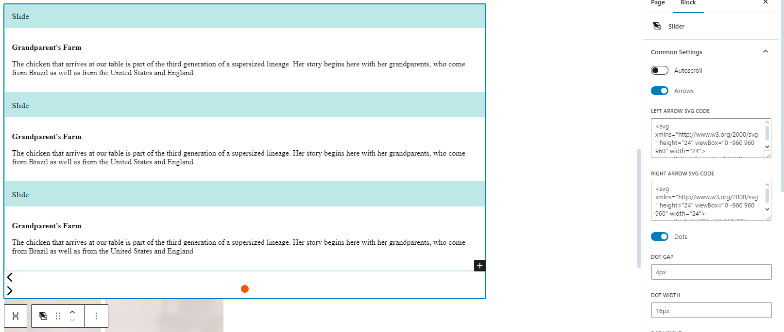
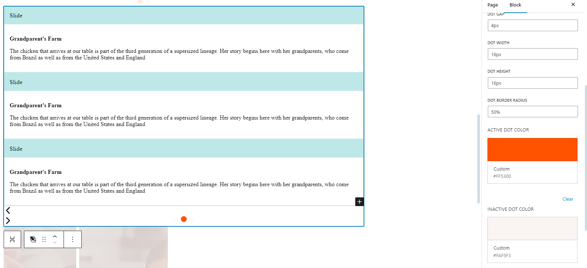
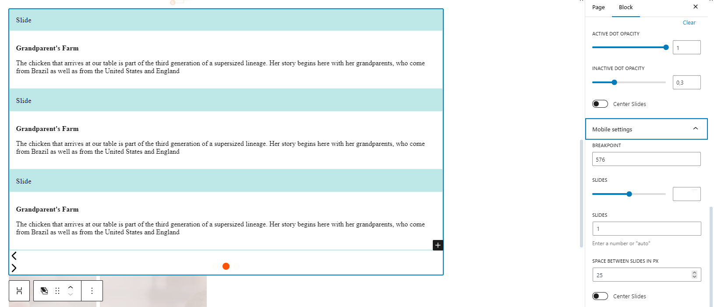
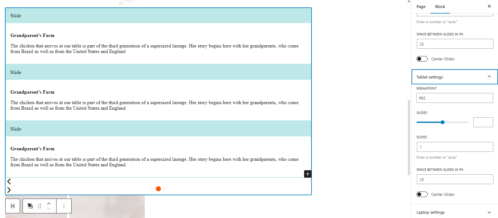

# Swiper-wordpress
## _Slider plugin for Wordpress Gutenberg based on Swiper.js_

Swiper-wordpress, being installed to Wordpress plugins folder, adds the Slider block to the Gutenberg block library.
Slider handles additional Slide blocks, which takes any Gutenberg blocks in it.

## Features

- Mobile/Tablet/Desktop/Huge-desktop settings
- Autoplay
- Arrows
- Dots
- Center Mode
- Slide value auto

## Tech

- SCSS - some slider styles
- JSX - Wordpress Gutenberg block code
- Swiper css & js bundles - to create slider on frontend
- Npm, Webpack, Babel - to build the project
- Eslint, stylelint - to lint JS/JSX/SCSS code according to Wordpress and Sass recommendations

## Installation

Swiper-wordpress requires [Node.js](https://nodejs.org/) v16+ to run.
Tested on Wordpress =^6.2.2 version.

Clone this repository to wp-content/plugins folder

```sh
git clone https://github.com/CristianR10/slide-swiper-block
```

Install the dependencies and build the assets.

```sh
npm i
npm run build
```

## Especification
The plugin allows you to:

- Change the color of dots
- Change the arrows
- Adjust the spacing between dots and the size of the dots
- Set the color of active and inactive dots
- Enable autoscroll
- Adjust the opacity
- Enable center mode
- Define breakpoints
- Set the number of slides for integer and float ranges




